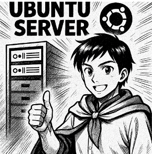

# NF1.UD1. Instal·lació Ubuntu Server

## Presentació de l'activitat

Toca posar-s'hi mans a l'obra i començar a muntar el nostre primer servidor Linux. Per què? Bona part de la feina dels administradors de sistemes consisteix a instal·lar i configurar servidors, i en molts casos, caldrà utilitar alguna distribució de GNU/Linux.

Què caldrà fer?

Crear una màquina virtual amb Ubuntu Server. Utilitzarem la versió LTS més recent. Aquesta màquina haurà de seguir estrictament els requeriments que trobareu a continuació. En cas contrari, l'avaluació serà negativa. Aquest és el primer pas per convertir-vos en superherois dels sistemes.

### Durada de l'activitat

La durada prevista de l'activitat és 4 hores a classe.

### Objectius específics de l'activitat

- Repassar les comandes bàsiques relacionades amb el sistema d'arxius.
- Repassar la gestió d'usuaris i grups.
- Repassar les accions relacionades amb la propietat i els permisos.

### Competències treballades

g) Realitzar les proves funcionals en sistemes microinformàtics i xarxes locals, localitzant i diagnosticant disfuncions, per comprovar i ajustar el seu funcionament.

o) Utilitzar els mitjans de consulta disponibles, seleccionant-ne el més adequat en cada cas, per resoldre en temps raonable supòsits no coneguts i dubtes professionals.

### Resultats d'aprenentatge i criteris d'avaluació

0222-RA3. Realitza tasques bàsiques de configuració de sistemes operatius, interpretant-ne requeriments i descrivint-ne els procediments seguits.

0222-RA4. Realitza operacions bàsiques d'administració de sistemes operatius, interpretant requeriments i optimitzant el sistema per al seu ús.

0222-RA5. Crea màquines virtuals identificant-ne el camp d'aplicació i instal·lant-hi programari específic.

En ser una activitat de repàs, no hi ha criteris d'avaluació específics. No obstant això, es valorarà la participació i implicació en la resolució de les activitats.

### Continguts

- Realització de tasques bàsiques sobre sistemes operatius lliures i propietaris.
- Administració dels sistemes operatius.
- Configuració de màquines virtuals.

### Capacitats clau treballades

- Responsabilitat
- Resolució de problemes

### Semàfor ús de la IA

🟠 Aquesta activitat permet un ús parcial o restringit.

Permès per com a eina de suport en la millora de la redacció dels informes, cerca preliminar d'informació, estructuració d'idees o explicació de conceptes teòrics complexos.

Condicions: Cal processar, entendre i validar sempre els resultats rebuts. Està totalment prohibit copiar l'enunciat d'un exercici directament al xat de la IA i enganxar la resposta generada per al lliurament final sense treball propi ni anàlisi crítica.

## Enunciat de l'activitat

### Indicacions

Al llarg d'aquest segon curs veurem comandes noves per resoldre accions que, de moment, no han estat necessàries. Però entendre bé com moure's pel sistema d'arxius, interactuar amb arxius i carpetes, gestionar els permisos i la propietat dels objectes, saber administrar usuaris i grups i gestionar aplicacions serà imprescindible al llarg dels diferents projectes.

Per aquest motiu, començarem repassant les comandes i accions bàsiques. Disposeu d'unes activitats que us serviran per repassar aquests continguts.

> **L'objectiu no és lliurar les activitats.** Les solucionarem conjuntament al final de la primera setmana.

### Durade l'activitat

La durada prevista de l'activitat és 2 hores a classe.

### Objectius específics de l'activitat

- Repassar les comandes bàsiques relacionades amb el sistema d'arxius.
- Repassar la gestió d'usuaris i grups.
- Repassar les accions relacionades amb la propietat i els permisos.

### Competències treballades

g) Realitzar les proves funcionals en sistemes microinformàtics i xarxes locals, localitzant i diagnosticant disfuncions, per comprovar i ajustar el seu funcionament.

o) Utilitzar els mitjans de consulta disponibles, seleccionant-ne el més adequat en cada cas, per resoldre en temps raonable supòsits no coneguts i dubtes professionals.

### Resultats d'aprenentatge i criteris d'avaluació

0222-RA3. Realitza tasques bàsiques de configuració de sistemes operatius, interpretant-ne requeriments i descrivint-ne els procediments seguits.

0222-RA4. Realitza operacions bàsiques d'administració de sistemes operatius, interpretant requeriments i optimitzant el sistema per al seu ús.

0222-RA5. Crea màquines virtuals identificant-ne el camp d'aplicació i instal·lant-hi programari específic.

En ser una activitat de repàs, no hi ha criteris d'avaluació específics. No obstant això, es valorarà la participació i implicació en la resolució de les activitats.

### Continguts

- Realització de tasques bàsiques sobre sistemes operatius lliures i propietaris.
- Administració dels sistemes operatius.
- Configuració de màquines virtuals.

### Capacitats clau treballades

- Responsabilitat
- Resolució de problemes

### Semàfor ús de la IA

🟠 Aquesta activitat permet un ús parcial o restringit.

Permès per com a eina de suport en la millora de la redacció dels informes, cerca preliminar d'informació, estructuració d'idees o explicació de conceptes teòrics complexos.

Condicions: Cal processar, entendre i validar sempre els resultats rebuts. Està totalment prohibit copiar l'enunciat d'un exercici directament al xat de la IA i enganxar la resposta generada per al lliurament final sense treball propi ni anàlisi crítica.

## Enunciat de l'activitat

### Indicacions