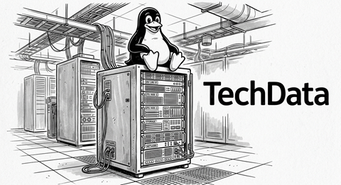

# NF1.UD3. Usuaris i grups

## Presentació de l'activitat

L'empresa "TechData S.L." ha instal·lat un nou servidor Linux (Ubuntu Server) i necessita configurar l'estructura d'usuaris i directoris de treball per a dos departaments:

- Departament de Desenvolupament (devs)
- Departament de Sistemes (sysadmin)
- Auditors externs (auditor)



Com a tècnic/a informàtic/a de sistemes de l'empresa, la teva tasca és crear els usuaris, assignar-los als seus grups corresponents, configurar la seguretat inicial i organitzar l'arbre de directoris compartits.

### Durada de l'activitat

La durada prevista de l'activitat és 4 hores a classe.

### Objectius específics de l'activitat

- Crear i gestionar grups principals i secundaris (groupadd, groupmod, gpasswd).
- Crear i gestionar comptes d'usuari (adduser, useradd, usermod, passwd).
- Comprendre la funció i estructura dels fitxers /etc/passwd, /etc/group i /etc/shadow.
- Configurar directoris de treball compartits amb permisos de grup adients (mkdir, chown, chmod).
- Bloquejar, desblocar i eliminar usuaris de manera segura.

### Competències treballades

c) Instal·lar i configurar programari bàsic i d’aplicació, assegurant-ne el funcionament en condicions de qualitat i seguretat.

j) Elaborar documentació tècnica i administrativa del sistema, complint les normes i reglamentació del sector, per al seu manteniment i l’assistència al client.

### Resultats d'aprenentatge i criteris d'avaluació

RA2. Gestiona usuaris i grups de sistemes operatius en xarxa, interpretant especificacions i aplicant eines del sistema.

- 2.1 Configura i gestiona comptes d'usuari.
- 2.2 Configura i gestiona perfils d'usuari.
- 2.4 Distingeix el propòsit dels grups, els seus tipus i àmbits.
- 2.5 Configura i gestiona grups.
- 2.6 Gestiona la pertinença d'usuaris a grups.
- 2.7 Identifica les característiques d'usuaris i grups predeterminats i especials.
- 2.9 Utilitza eines per a l'administració d'usuaris i grups, incloses en el sistema operatiu en xarxa.

### Continguts

2.Gestió d'usuaris i grups:

 2.1 Compte d'usuari i grup.
 2.2 Tipus de perfils d'usuari. Perfils mòbils.
 2.3 Gestió de grups. Tipus i àmbits. Propietats. Usuaris i grups predeterminats i especials  del sistema.
 2.4 Comptes d'usuari. Plantilles.

### Capacitats clau treballades

- Autonomia
- Organització del treball
- Responsabilitat

### Semàfor ús de la IA

🟠 Aquesta activitat permet un ús parcial o restringit.

Permès per com a eina de suport en la millora de la redacció dels informes, cerca preliminar d'informació, estructuració d'idees o explicació de conceptes teòrics complexos.

Condicions: Cal processar, entendre i validar sempre els resultats rebuts. Està totalment prohibit copiar l'enunciat d'un exercici directament al xat de la IA i enganxar la resposta generada per al lliurament final sense treball propi ni anàlisi crítica.

## Enunciat de l'activitat

### Requeriments previs

Cal que tingueu un servidor Linux (Ubuntu Server) instal·lat i configurat de l'activitat anterior. Cas que sigui necessari, torneu a desplegar el servidor a partir del fitxer `.OVA` que vau generar.

### Tasca 1. Creació de la jerarquia de grups

1. Crea els següents grups nous al sistema:

    - devs (per al personal de desenvolupament)
    - sysadmin (per al personal de sistemes)
    - auditor (per a l'usuari auditor extern)

2. Comprova que els grups s'han creat correctament consultant les últimes línies del fitxer `/etc/group`. Identifica clarament el GID de cadascun dels dos grups.

### Tasca 2. Gestió dels perfils d'usuari

1. L'empresa vol que tots els usuaris nous que es donin d'alta a partir d'ara tinguin automàticament:

    - Un fitxer de benvinguda al seu directori personal amb les normes d'ús del servidor.
    - Una carpeta anomenada Documents creada per defecte.
    - Un alias configurat al seu terminal perquè quan escriguin `ll` s'executi `ls -la --color=auto`.

    Per fer aconseguir aquestes personalitzacions, cal que modifiqueu el directori plantilla `/etc/skel` amb els fitxers i configuracions necessàries.

    > ℹ️ Per crear un alias, heu d'afegir la línia següent al fitxer `.bashrc` del directori `/etc/skel`:
    >
    > ```bash
    > alias ll='ls -la --color=auto'
    > ```

2. Ajust de configuració per defecte (/etc/adduser.conf):

    - Revisa el fitxer `/etc/adduser.conf` i assegura't que la shell per defecte per als nous usuaris sigui `/bin/bash` (DSHELL=/bin/bash).

### Tasca 3. Creació i configuració d'usuaris

1. Crea els següents usuaris amb les característiques indicades:

| Nom d'usuari | Nom real       | Grup principal | Grups secundaris | Directori personal | Shell     |
|---           |---             |---             |---               |---                 |---        |
| pau_dev      | Pau Garcia     | devs           | —                | /home/pau_dev      | /bin/bash |
| laura_dev    | Laura Martí    | devs           | —                | /home/laura_dev    | /bin/bash |
| marc_sys     | Marc Soler     | sysadmin       | devs             | /home/marc_sys     | /bin/bash |
| auditor      | Usuari Auditor | auditor        | —                | /home/auditor      | /bin/bash |

Instruccions específiques:

1. Utilitza la comanda `adduser` per crear els usuaris pau_dev i laura_dev.

2. Utilitza la comanda `useradd` amb els paràmetres corresponents per crear marc_sys i auditor.

3. Assigna a tots els usuaris la contrasenya inicial `Canviam2026!`.

4. Obliga l'usuari pau_dev a canviar la contrasenya en el seu pròxim inici de sessió (chage).

5. Inicia sessió com pau_dev verifica que cal canviar la contrasenya.

### Tasca 4. Inspecció del sistema i fitxers de configuració

Respon a les següents preguntes mostrant la informació corresponent dels fitxers del sistema:

1. Executa la comanda `id marc_sys`. Quins UID, GID i grups té assignats?

2. Quina diferència hi ha entre la informació de l'usuari pau_dev a `/etc/passwd` i la informació del fitxer `/etc/shadow`? Quin tipus de permisos té el fitxer `/etc/shadow` i per què?

3. Quin és el directori plantilla que s'utilitza per omplir el `/home` d'un usuari nou quan es crea? Quina comanda o fitxer en defineix aquesta configuració?

### Tasca 5. Manteniment, bloqueig i eliminació

1. El treballador pau_dev marxa de vacances. Bloqueja el seu compte perquè no pugui iniciar sessió temporalment.

2. Comprova que el compte està bloquejat mirant el fitxer `/etc/shadow`.

3. Desbloqueja de nou el compte de pau_dev.

4. L'usuari auditor ha finalitzat la seva feina i deixa l'empresa. Elimina l'usuari auditor juntament amb el seu directori personal i la seva bústia de correu.

### Tasca 6. Personalització de l'entorn d'usuari

Hem vist a la tasca 2 com es pot predeterminar el shell pels usuaris nous que es creen. Ara bé, un cop definits, podem canviar el shell d'un usuari concret amb la comanda `usermod` o `chsh`.

1. Instal·la el paquet `fish`.

2. Canvia el teu shell per defecte de l'usuari laura_dev a `fish`. Comprova a l'arxiu `/etc/passwd` que el shell s'ha canviat correctament.

3. Inicia sessió com laura_dev (usant `su - laura_dev`) i comprova que el shell és `fish`.

> 💡`fish` és un shell modern que funciona sense configuració prèvia i que té força avantatges que l'han fet molt popular entre desenvolupadors: autocompletat intel·ligent, comprovació sintaxi en temps real, etc (podeu veure més informació a l'enllaç a Materials de suport). Tot i això, s'ha de tenir en compte que no és compatible amb l'estàndard POSIX, per tant no es recomana mai per la shell de sistema (root) o d'administració.

### Què cal lliurar?

Lliureu la guia d'instal·lació amb les captures i explicacions necessàries a la tasca del Moodle corresponent.

Per a cada apartat de l'activitat, la documentació hauria d'incloure, sempre que sigui necessari:

1. **L'objectiu de l'acció.**
2. **La comanda o configuració utilitzada.**
3. **Una explicació del funcionament.**
4. **Una captura de pantalla del resultat.**
5. **Una breu conclusió o comprovació**, quan sigui necessari.

> ## 📚 Recordeu
>
> **«Documentar, documentar i documentar.»**

## Material de suport

- [NF1.UD3-Usuaris i grups](https://smx-sox.github.io/Materials/NF1_SOX_Linux/UD3-Usuaris_Grups/)

- Ubuntu Server Documentation. [User Management](https://ubuntu.com/server/docs/how-to/security/user-management/)

- ytelearning. */etc/skel; ¿Qué es y qué podemos hacer con él?*. Juliol 2016.[enllaç](https://bytelearning.blogspot.com/2016/07/etcskel-que-es-y-que-podemos-hacer-con.html)

- [Fish Shell](https://fishshell.com/)
